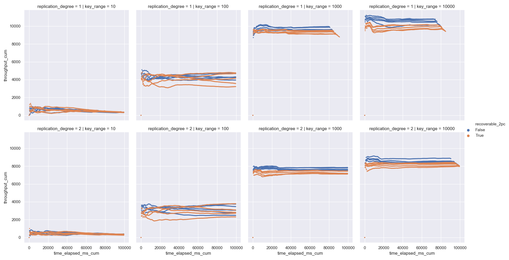
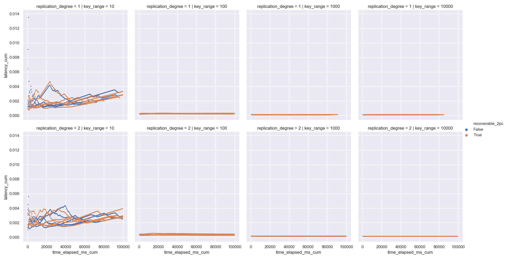
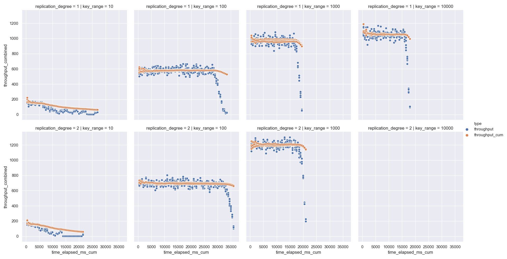
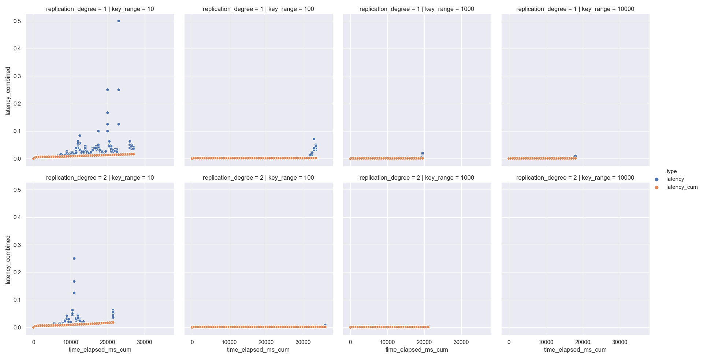
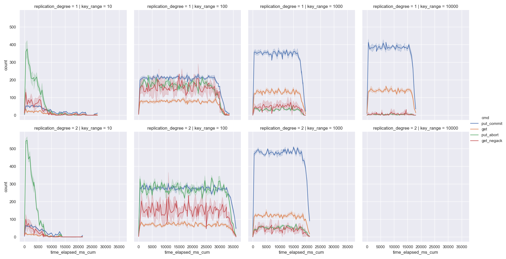

# Distributed-Hash-Table
CSE 403: Advanced Operating Systems

I didn't add much documentation for the assignment 1 charts, as they were made in excel, 
but I'll link the assignment 2 charts here for posterity.

### Assignment 3
I made the 2PC implementation for Assignment 2 have enough logging to stable storage to be "theoretically" recoverable. Additionally, I fixed major bugs and made huge performance improvements. Assignment 3 is around 50x faster than assignment 2.

Throughput

Latency

### Assignment 2
I converted the DHT into a replicated hash table with a configurable replication degree. Added 2 Phase Commit for put operations.

Throughput (See raw PNG for zoom)

Latency

Raw operation counts (95% Confidence Interval)
- Notice the high number of put_aborts for low key ranges
- And spikes in get_negack, as a client tries to get a key on its own node, which is locked by a different client.

